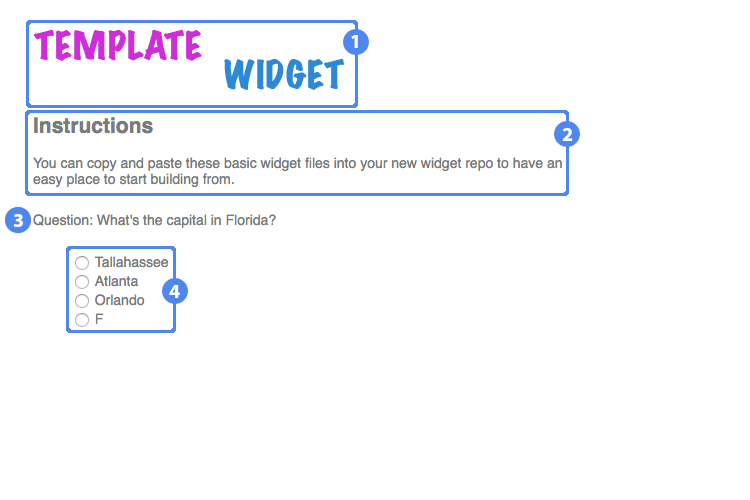

# Overview

Template Widget serves as a very basic example of how to construct a valid, usable Materia widget. The player interface presents a single question with four possible answers, of which the user can only choose one.

1. Widget title
2. Instructions
3. Question text
4. Answer selection area

## Details

### Answer Selection

Selecting an answer will immediately submit the chosen answer for scoring.

